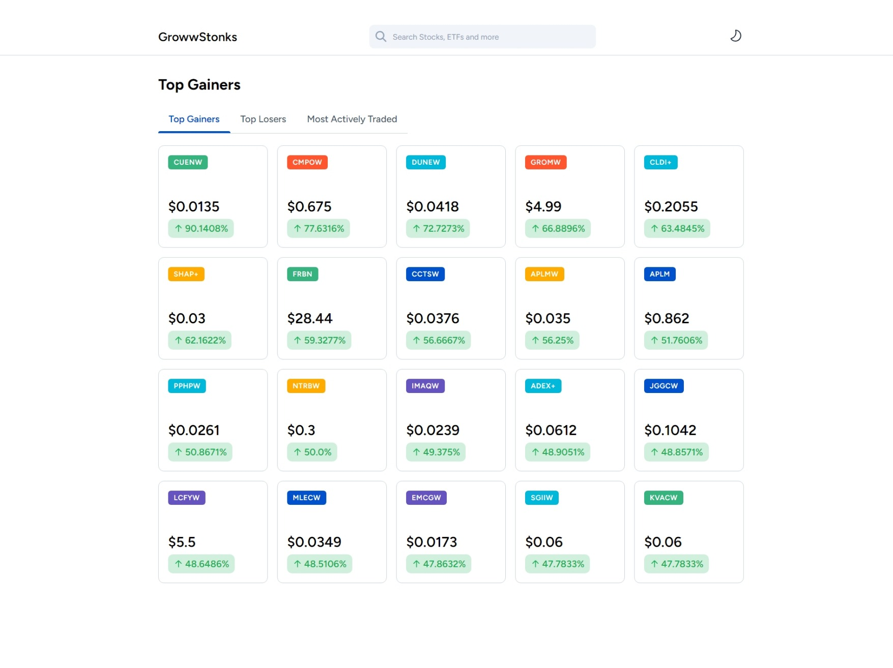
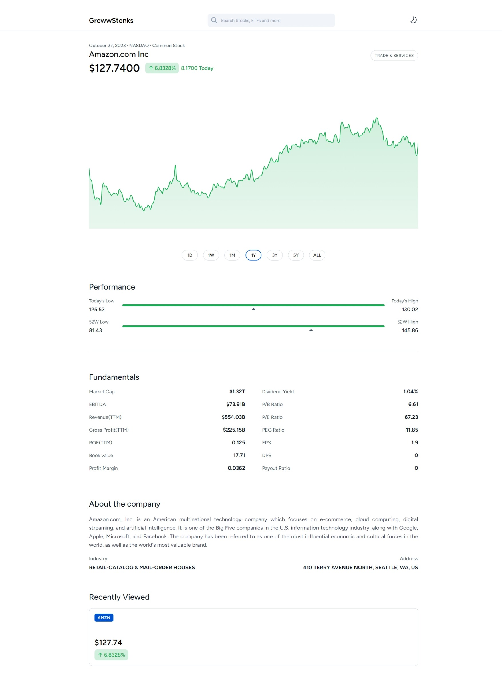

<h1 align="center">GrowwStonks</h1>

<div align="center">
Another awesome project to make the world a better place.
</div>

<br />

<div align="center">
  <a href="https://standardjs.com">
    
  </a>
  
  

  

  

  
</div>

## ⚡️ Introduction




## 🎯 Features

- Client Side Caching using Local Storage
- Hide API key by proxying through serverless function
- Debounced search keywords
- Recently viewed companies
- View stocks price for last 20 years
- Dark Mode
- Proper handling of loading and error state
- And much more, explore gstonks.

## ⚙️ Installation

Make sure you have [Node.js](https://nodejs.org/en/download/) installed.
Run this followed commands:

```bash
# Install dependencies (only the first time)
npm install

# Run the local server at localhost:3000
npm run dev

# Build for production
npm run build
```

## 🌱 Third Party Libraries

- [vercel/next.js](https://github.com/vercel/next.js)
- [facebook/react](https://github.com/facebook/react)
- [plouc/nivo](https://github.com/plouc/nivo)

## ❤️ Acknowledgements

- [Groww](https://groww.in/stocks/reliance-industries-ltd)
- [TickerTape](https://www.tickertape.in/stocks/reliance-industries-RELI)
- [Google Finance](https://www.google.com/finance/quote/GOOGL:NASDAQ?window=YTD)

## ‍💻 Author

- [@iamsahebgiri](https://github.com/iamsahebgiri)

## ⭐️ Contribute

If you want to say thank you and/or support the active development of gstonks:

1. Add a GitHub Star to the project.
2. Tweet about the project on your Twitter.
3. Write a review or tutorial on Medium, Dev.to or personal blog.
4. Support the project by donating a cup of coffee.

## 🧾 Copyright

Copyright (c) 2023 [Saheb Giri](https://github.com/iamsahebgiri).
